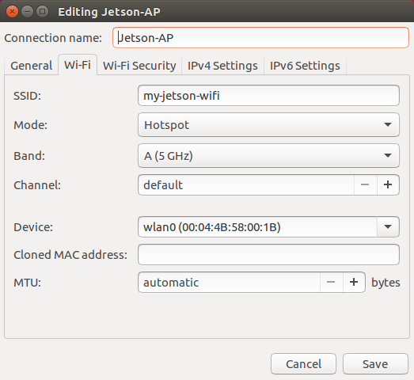

There are two major steps that need to be performed to initialize your NVIDIA Jetson and install all project dependencies.

# Installing JetPack
Download JetPack from the [NVIDIA website](https://developer.nvidia.com/embedded/jetpack) and run the install script. Some components like **VisionWorks Pack** and **Compile CUDA Samples** can be skipped in order to save space and speed up the installation:

After installing the JetPack, create a WiFi access point (AP) on Jetson using the Ubuntu Network Manager or `nmcli` utility. Here is an example of such network configuration where the WiFi network has been named `my-jetson-wifi`:

Make sure that your WiFi network is secure and uses a reasonable password.

Note: that you may need to apply [this change](http://elinux.org/Jetson/TX1_WiFi_Access_Point) to enable SSID broadcast.

#### Auvidea J-120 with Jetson TX2 notes
There is currently a known issue with J-120 board and TX2 affecting USB devices. Please refer to the [documentation](../blob/master/tools/install/j120-tx2-patch/README.md) to get it fixed.
 
# Installing project dependencies
Our project has several dependencies like ROS, GStreamer and others that need to be installed before running the code. The `jetson_ros_install.sh` script located in `ros/scripts` will install all required dependencies. The script requires some input (very little) so make sure you are monitoring the console while the script is running.
Once the script completes running, log out and log in back again to make sure all ROS environment variables are initialized.
 