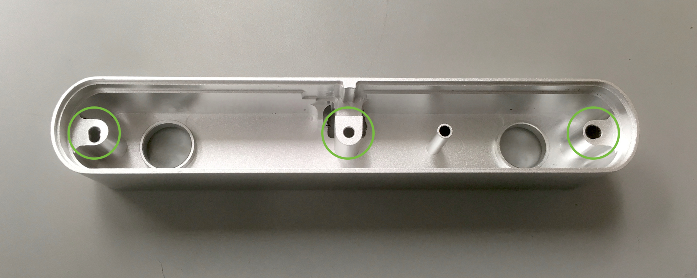

## Introduction

For stereo vision (and pose estimation), you can mount a ZED camera to the front of the TBS Discovery.

Before performing any hardware modifications, we recommend first completing the [relevant portion](Skypad-Software-Setup-Guide#Optional-ZED-Setup) of the software setup guide.

## Materials

-   ZED Camera
-   Double-sided adhesive
-   Optional housing replacement:
    -   Drill and/or pliers for disassembly
    -   3D-Printed housing ([Front](../../blob/master/tools/platforms/skypad/ZED%20Housing%20Front.stl) and [Back](../../blob/master/tools/platforms/skypad/ZED%20Housing%20Back%20Plate.stl))
    -   6x M2 8mm nuts and bolts
    -   2x rubber bands, glue, or tape
-   Optional RF shielding sheet (see the section on [RF shielding](#rf-shielding))

## Optional ZED Camera Housing Replacement

In order to cut down on the weight of the ZED camera, you can remove the heavy aluminum housing from the ZED and replace it with a lighter 3D-printed housing.  If you'd like to keep the original housing, skip to [Assembly & Attachment](#assembly--attachment).

The original aluminum/plastic housing weighs around 120 grams, versus ~50 grams for our printed housing, depending on the material used. The modification process is a bit involved and not strictly necessary, but it should improve the flight time.

To remove the housing from the ZED camera:

1.  Remove the glued-on front plastic cover which obstructs the interior screw holes.  You can either drill through the screw holes as documented in [this guide](http://www.instructables.com/id/ZED-Disassembly/) (preserving the cover for potential reuse), or pry the front casing off entirely (if you're sure you won't need to reuse it).

2.  Unscrew the three screws (marked in the removed housing below):

    

3.  Once the three screws are removed, you can pry out the back plastic (which is screwed to the main circuit board); the back plastic is not glued in, but can be difficult to get leverage on (pulling the cord won't work).

4.  After removing the back plastic and circuit board, unscrew the circuit board from the back plate.

Once the old housing has been removed, installing the new housing is straightforward:

1.  Print the new housing using the provided [ZED Housing Front.stl](../../blob/master/tools/platforms/skypad/ZED%20Housing%20Front.stl) and [ZED Housing Back Plate.stl](../../blob/master/tools/platforms/skypad/ZED%20Housing%20Back%20Plate.stl) files.

2.  Bolt the ZED circuit board to the back plate using M2 nuts and bolts.

    

3.  Slide on the front plate and lock it in place with rubber bands, glue, or tape.

4.  (Optionally) Re-calibrate the camera and clean the lenses.

## Assembly & Attachment

1.  If it is attached, unscrew the stand from the bottom of the ZED camera housing.

2.  Using a double-sided adhesive strip, mount the ZED camera housing to the front of the TBS Discovery, being careful to align it facing straight ahead.

    

3.  Tie up the ZED USB3 cable using a twist or zip tie to minimize space usage; we suggest wrapping around the bottom plate directly behind the camera.

4.  Connect the free end of the ZED USB3 cable to the **top** USB3 port on the J120 carrier board (the bottom one will not work).

5.  Once the ZED is attached, check that you can read images from the camera using one of the `zed-ros-wrapper` ROS nodes (see the [software setup guide](./Skypad-Software-Setup-Guide#zed-software-setup)).

## RF Shielding

The ZED camera's USB 3.0 cable may generate unwanted radio noise which interferes with GPS reliability.  In practice, this can result in poor performance of GPS-based stabilization while the ZED is active.

We found that moving the GPS/Compass module to the back of the drone (behind the PixFalcon) and layering RF shielding below the GPS was effective at eliminating USB 3.0-based GPS noise.  Our modified drone looks like this (using double-sided adhesive/tape to attach the GPS/shielding):

---

 This work is licensed under a <a rel="license" href="http://creativecommons.org/licenses/by/4.0/">Creative Commons Attribution 4.0 International License</a>