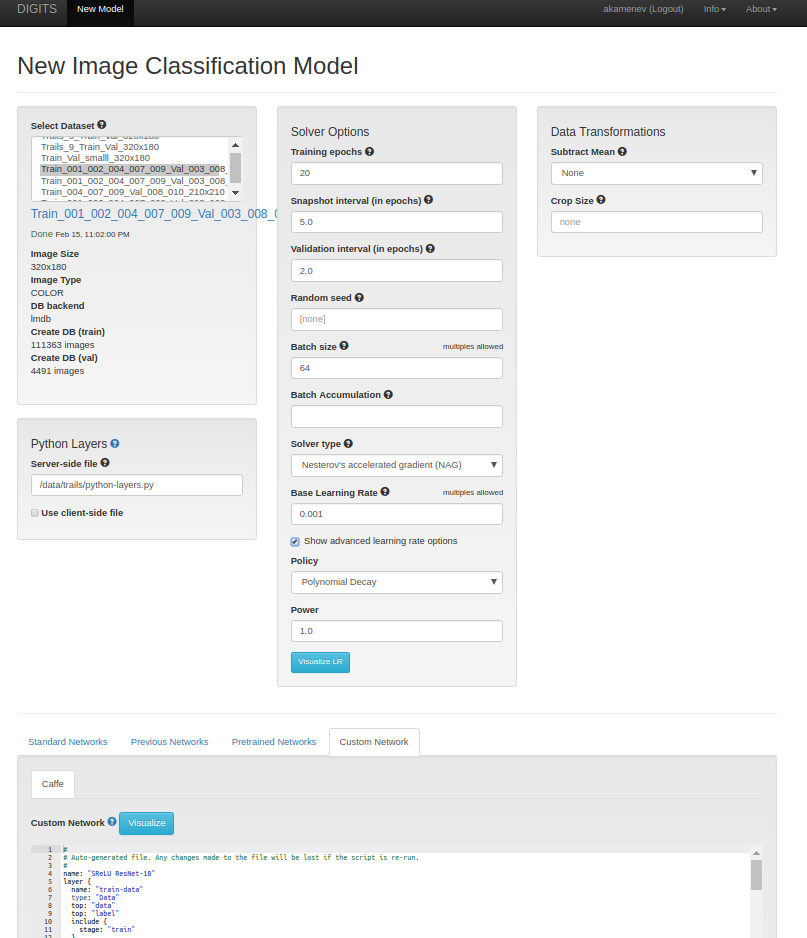

TrailNet DNN has two heads, orientation and translation, so it should be trained in two steps:
1. Full training of orientation head on orientation dataset (e.g. Forest Trails or user-collected).
2. Fine-tuning translation head on translation dataset (user-collected).

The next steps describe how to do it using NVIDIA DIGITS.

# Training orientation head
To train orientation head:
1. Create a new **Image Classification Model**.
2. Select proper dataset.
3. Set all hyper-parameters values like in the paper (you can experiment with hyper-parameter tuning later).
4. Provide full path to Python layers file located at `redtail/models/nets/python-layers.py`.
5. Click on **Custom Network** tab and paste network definition from `redtail/models/nets/ResNet/srelu-resnet-18.prototxt`.
6. Click **Create** button and wait until the training is finished.

Example:

# Training translation head
The fine-tuning on translation dataset is very similar to full training with just a couple of differences:
1. Use `TrailNet_SResNet-18.prototxt`  model definition file.
2. Provide full path to pretrained orientation model in **Pretrained model(s)** field on **Custom Network** tab.

Example:

